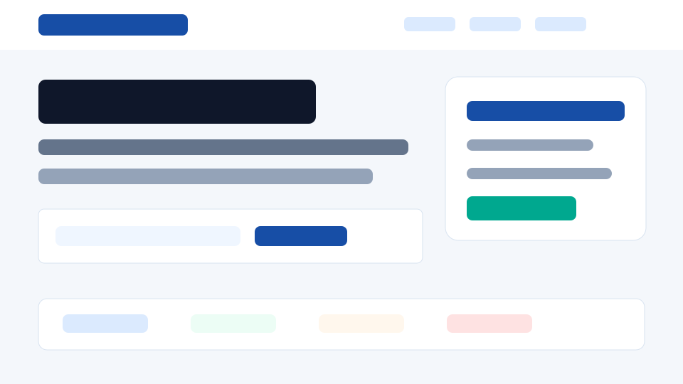
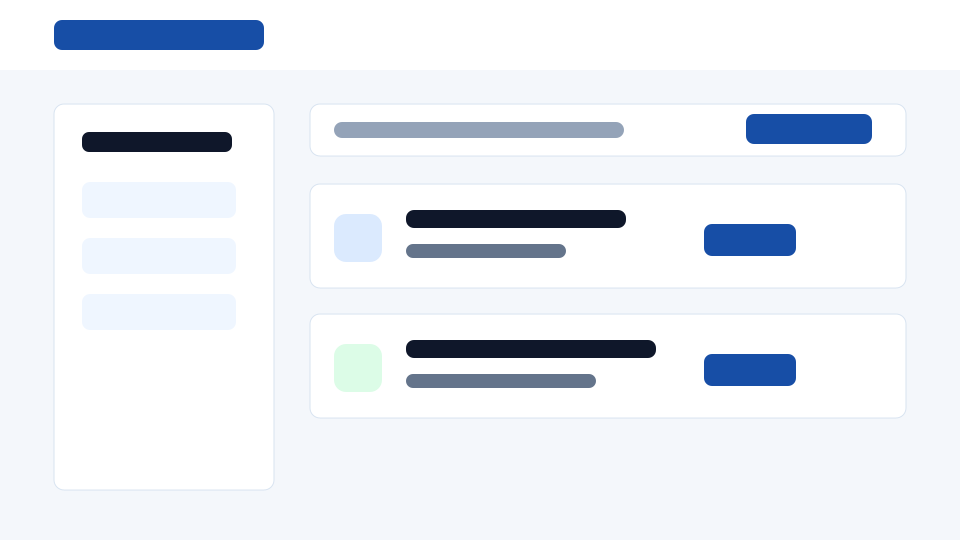

# CareerConnect

CareerConnect is a production-ready static Job Portal & Recruitment System built with HTML5, CSS3, and vanilla JavaScript. It feels like a modern recruitment platform inspired by LinkedIn Jobs, Indeed, and Naukri, while remaining deployable as plain static files.

## Highlights

- Live jobs integration with Adzuna or JSearch when API keys are configured.
- Automatic fallback to `data/jobs.json` when keys are missing, APIs fail, rate limits are reached, CORS blocks a request, or no results are returned.
- Live hiring news integration with GNews plus local fallback articles.
- Hash routing for `#home`, `#jobs`, `#companies`, `#saved`, `#news`, `#about`, and `#contact`.
- Real-time debounced search by keyword, location, company, salary, experience, job type, and work model.
- Interactive Leaflet map with OpenStreetMap tiles and job markers.
- Trending dashboard cards, animated counters, and Chart.js visualizations.
- Company profiles with logo, description, industry, website, location, and open jobs.
- Saved jobs using Local Storage, including live API job snapshots.
- External employer application links.
- Dark mode with Local Storage theme persistence.
- Notifications for loaded jobs, saved jobs, empty searches, fallback data, and unavailable APIs.
- Loading skeletons, smooth transitions, responsive cards, and accessible focus states.
- SEO metadata, Open Graph tags, Twitter cards, favicon, `robots.txt`, and `sitemap.xml`.
- Deployment-ready configs for Vercel, Netlify, Render, and GitHub Pages-compatible static hosting.

## Folder Structure

```text
CareerConnect/
├── index.html
├── jobs.html
├── companies.html
├── saved.html
├── news.html
├── apply.html
├── about.html
├── contact.html
├── css/
│   ├── style.css
│   ├── style.min.css
│   ├── responsive.css
│   ├── responsive.min.css
│   ├── animations.css
│   └── animations.min.css
├── js/
│   ├── app.js
│   ├── app.min.js
│   ├── api.js
│   ├── api.min.js
│   ├── router.js
│   ├── router.min.js
│   ├── jobs.js
│   ├── jobs.min.js
│   ├── filters.js
│   ├── filters.min.js
│   ├── storage.js
│   ├── storage.min.js
│   ├── news.js
│   ├── news.min.js
│   ├── map.js
│   ├── map.min.js
│   ├── charts.js
│   ├── charts.min.js
│   ├── apply.js
│   └── apply.min.js
├── data/
│   ├── jobs.json
│   └── news.json
├── assets/
│   ├── images/
│   ├── icons/
│   ├── logo.png
│   └── logo.svg
├── robots.txt
├── sitemap.xml
├── vercel.json
├── netlify.toml
├── render.yaml
├── README.md
└── LICENSE
```

## API Configuration

The project works without keys because local fallback data is built in. To enable live APIs, set configuration in the browser before loading the app, or inject it from your static host.

```html
<script>
  window.CAREERCONNECT_CONFIG = {
    provider: "adzuna",
    adzunaAppId: "YOUR_ADZUNA_APP_ID",
    adzunaAppKey: "YOUR_ADZUNA_APP_KEY",
    adzunaCountry: "us",
    gnewsApiKey: "YOUR_GNEWS_API_KEY"
  };
</script>
```

For JSearch through RapidAPI:

```html
<script>
  window.CAREERCONNECT_CONFIG = {
    provider: "jsearch",
    rapidApiKey: "YOUR_RAPIDAPI_KEY",
    gnewsApiKey: "YOUR_GNEWS_API_KEY"
  };
</script>
```

You can also store the same object in Local Storage under `careerconnect.apiConfig` for local testing.

## Run Locally

Serve the folder over HTTP because ES modules and `fetch()` need a web origin.

```bash
python -m http.server 5500
```

Open:

```text
http://localhost:5500/index.html#home
```

## Deployment

CareerConnect is fully static and has no build step.

- Vercel: import the repository and use the project root as the output directory.
- Netlify: publish the project root.
- Render: create a Static Site with `staticPublishPath: .`.
- GitHub Pages: publish from the root branch folder. The `.nojekyll` file is included.

## Technologies

- HTML5
- CSS3
- Vanilla JavaScript ES Modules
- Fetch API
- Local Storage and Session Storage
- Leaflet.js with OpenStreetMap tiles
- Chart.js
- Adzuna Jobs API or JSearch API
- GNews API

## Screenshots





## Notes

API keys in a static frontend are visible to users. For production businesses, proxy API requests through a secure backend. This project keeps the requirement static-only and handles external API failure gracefully.

## Author

CareerConnect

## License

This project is licensed under the MIT License.
